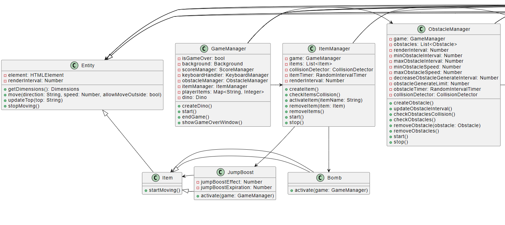
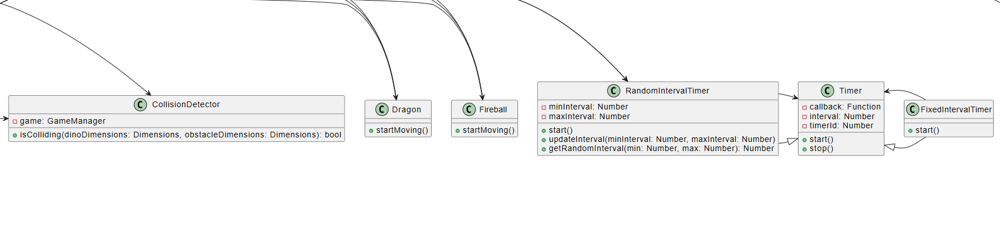
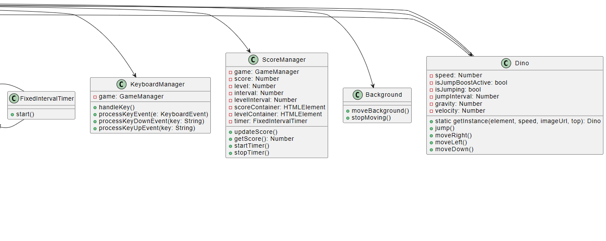

# Javascript Term Project

---

## 1. 摘要

Dino Runner 是一款受 Chrome 瀏覽器中經典恐龍遊戲啟發的橫向捲軸遊戲。玩家會操作一隻恐龍，在不斷前進的過程中跳躍和閃避各種障礙物，並收集道具來提高生存時間和分數。本報告將詳細介紹遊戲的設計和實作過程，包括系統功能、架構設計、開發平台和工具、實作細節以及結論與心得。

---

## 2. 系統功能與用途

### 2.1 用途

Dino Runner 是一款休閒遊戲，旨在提供簡單但富有挑戰性的遊戲體驗。玩家可以通過控制恐龍跳躍和閃避障礙物，來挑戰自己的反應速度和決策能力。此外，遊戲中加入了多種道具，增加了變化性和趣味性，吸引玩家持續遊玩。

### 2.2 提供的功能

- **恐龍控制**：玩家可以通過鍵盤操控恐龍進行跳躍和閃避。
- **背景動畫**：創建連續流動的背景，使遊戲更具動感。
- **障礙物生成與管理**：隨機生成並管理多種類型的障礙物，增加遊戲的挑戰性。
- **道具生成與效果**：提供多種道具，使遊戲具有更多變化和策略性。
- **分數計算與顯示**：即時計算和更新玩家的遊戲分數，激勵玩家挑戰更高的分數。

---

## 3. 系統架構與設計

Dino Runner 的設計採用模組化和物件導向的方法，以確保系統的可維護性和擴展性。以下是系統的核心架構和主要模組：



架構圖 (左)



架構圖 (中)



架構圖 (右)

### 3.1 核心類別說明

- **Background**：負責背景的移動效果。
- **Entity**：定義遊戲中的基本物件，包括恐龍、障礙物和道具。
- **Dino**：恐龍角色的具體實現，繼承自 `Entity`，負責角色的跳躍和移動。
- **ObstacleManager**：管理障礙物的生成、移動和碰撞檢測。
- **ItemManager**：管理道具的生成、效果啟動和移除。
- **ScoreManager**：負責分數的計算和顯示。
- **KeyboardManager**：處理鍵盤輸入事件，控制恐龍的行為。

### 3.2 程式功能與邏輯

1. **遊戲初始化**：設置遊戲的初始狀態，包括背景、角色、障礙物和道具的加載。
2. **開始遊戲**：啟動遊戲循環，背景開始移動，並開始生成障礙物和道具。
3. **遊戲進行中**：根據用戶的鍵盤輸入控制恐龍的行為，同時處理障礙物和道具的移動和碰撞檢測。
4. **碰撞檢測**：檢測恐龍與障礙物或道具之間的碰撞，並根據碰撞結果更新遊戲狀態。
5. **分數計算**：持續計算和更新玩家的遊戲分數。
6. **遊戲結束**：當恐龍與障礙物碰撞時，終止遊戲循環，並顯示遊戲結束畫面。

---

## 4. 開發平台與工具

### 4.1 開發平台

Dino Runner 的開發在以下環境中進行：

- **操作系統**：Windows 10
- **瀏覽器**：主要在 Google Chrome 上進行開發和測試

### 4.2 開發工具與框架

- **程式語言**：JavaScript, HTML, CSS
- **開發工具**：Visual Studio Code, Git, Live Server
- **框架/程式庫**：無

---

## 5. 伺服器與執行環境

Dino Runner 是一個前端遊戲，不需要資料庫來運行。然而，這個遊戲需要先在本地端開好伺服器才能夠執行。以下是我在開發時的執行環境

- **執行平台**：Chrome
- **操作系統**：Windows 10
- **伺服器**：Vscode Live Server

## 6. Config

```jsx
const config = {
  game: {
    renderInterval: 10, // render interval in milliseconds
    gravity: 0.8, // gravity effect
  },
  dino: {
    speed: window.innerWidth * 0.05,
    jumpInterval: 15, // jump interval that compute gravity in milliseconds
  },
  background: {
    speed: 5,
  },
  obstacle: {
    minGenerateInterval: 800, // minimum interval for generating obstacles in milliseconds in the beginning
    maxGenerateInterval: 1700, // maximum interval for generating obstacles in milliseconds in the beginning
    generateLimit: 100, // Smallest interval for generating obstacles in milliseconds
    minSpeed: 5, // minimum obstacle speed
    maxSpeed: 8, // maximum obstacle speed
    decreaseGenerateInterval: 50, // decrease obstacle interval for this interval (For every level decrease the obstacle generate interval)
  },
  score: {
    interval: 100, // update score in milliseconds
    levelInterval: 50, // update level for this interval (For every 50 points increase the level)
  },
  item: {
    speed: 3, // item speed
    minGenerateInterval: 1000, // minimum interval for generating items
    maxGenerateInterval: 3000, // maximum interval for generating items
    bombHeight: "70vh", // bomb top position
    jumpBoostHeight: "50vh", // jump boost top position
    jumpBoostEffect: 2, // value that will divide the gravity
    jumpBoostExpiration: 5000, // jump boost effect expiration time in milliseconds
  },
};

export default config;
```

我有用 Config 將遊戲可能會調整的參數包起來，可以在這邊修改參數就能夠修改遊戲內的行為了。

## 7. 結論與心得

### 7.1 心得

在 Dino Runner 的開發過程中，我通過模組化的設計和精細的系統架構，成功地實現了一個簡單但具有挑戰性的橫向捲軸遊戲。每一個模組的實現都經歷了詳細的設計和多次迭代，特別是在碰撞檢測和遊戲性能優化方面，我進行了多次測試和調整，以確保遊戲的平滑體驗。

因為是第一次從頭開始製作一個小型專案，其實一開始架構都很不清楚，從一開始只用各種 function 到慢慢包出很多個 class 出來，看到雜亂無章的程式碼被包起來其實還蠻有成就感的XD。

另外，我有將這次的專案部屬到 [GitHub Page](https://bee0511.github.io/Dino-Runner/) 上面，可以讓大家可以直接到網頁遊玩。

### 7.3 未來改進方向

未來的改進方向包括：

- **添加更多的遊戲元素**：例如新的障礙物和道具類型，以及不同的遊戲模式。
- **排行榜**：希望可以記錄每個用戶的遊戲最高分，並製作出一個排行榜。

通過這些改進，我希望能夠進一步提升 Dino Runner 的遊戲性和玩家體驗，使其成為一款更加完整和具有吸引力的遊戲。